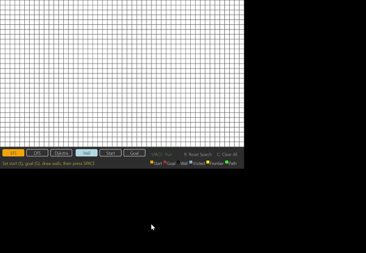

# Graph Algorithm Visualizer

An interactive pathfinding visualizer built with Python and Pygame. Draw walls, set start and goal points, and watch BFS, DFS, and Dijkstra's algorithm find the path in real time.

## Demo



## Algorithms

| Algorithm | Guarantees Shortest Path | Strategy |
|---|---|---|
| BFS | Yes | Explores layer by layer |
| DFS | No | Goes deep before backtracking |
| Dijkstra | Yes | Prioritizes lowest cost nodes |

## Controls

| Key | Action |
|---|---|
| `W` | Wall mode — draw/erase walls |
| `S` | Start mode — place start point |
| `G` | Goal mode — place goal point |
| `1` | Select BFS |
| `2` | Select DFS |
| `3` | Select Dijkstra |
| `SPACE` | Run selected algorithm |
| `R` | Reset search (keep walls) |
| `C` | Clear everything |
| `ESC` | Quit |

## Installation

```bash
pip install pygame
python main.py
Project Structure
graph-algorithms/
├── algorithms/
│   ├── bfs.py
│   ├── dfs.py
│   └── dijkstra.py
├── main.py
├── grid.py
├── node.py
├── visualizer.py
└── utils.py
Tech Stack
Python • Pygame